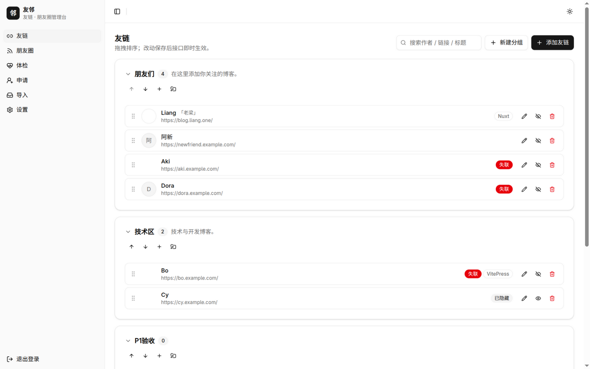
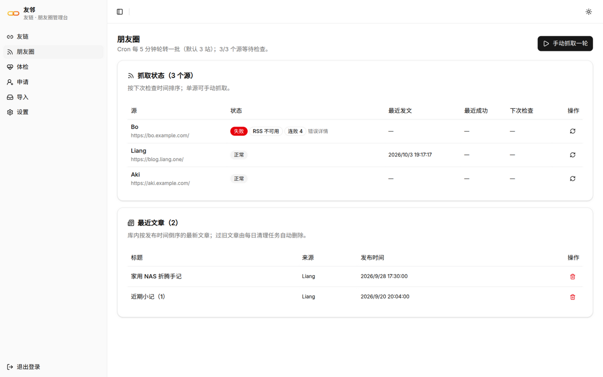
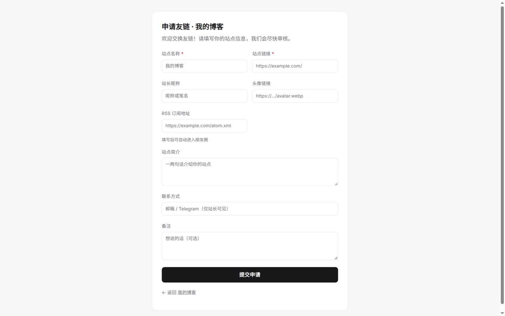
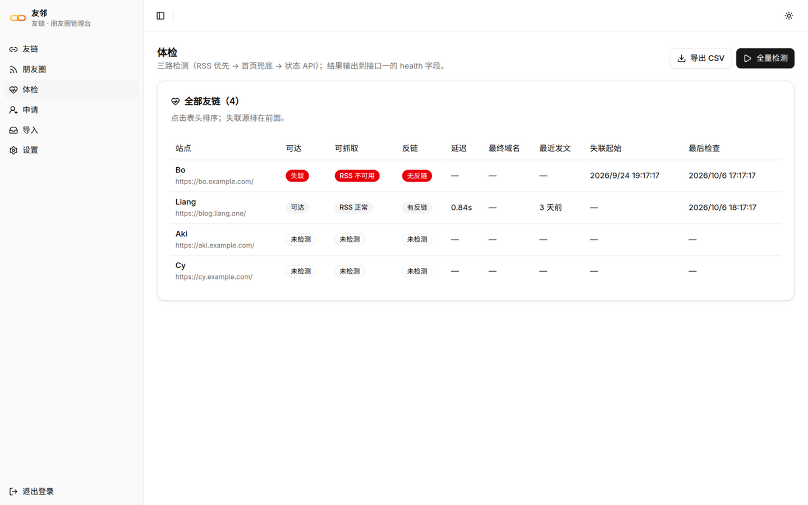
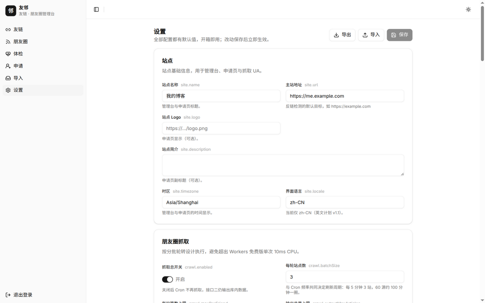

# 友邻 Youlin

[](https://github.com/lmb666666/youlin/actions/workflows/ci.yml)
[](LICENSE)

友邻是一个自托管的友链和朋友圈管理台，部署在 Cloudflare Workers 上。

以前加友链需要修改数据文件、等构建，朋友圈要单独维护脚本，友链申请散落在评论区；现在这些工作都在一个网页里完成。博客端不需要安装任何东西，fetch 两个接口即可渲染。

项目 MIT 开源，单实例部署，个人站点在 Cloudflare 免费额度内运行。

<picture>
  <source media="(prefers-color-scheme: dark)" srcset="docs/images/admin-links-dark.png">
  
</picture>

## 特色 | Features

### 友链

- 增删改、分组、拖拽排序都在网页里完成，保存后刷新博客页面即生效
- 填写站点地址后，自动探测 RSS、favicon、头像和站点标题并填入表单
- 隐藏的友链不出现在接口数据里
- 可以从任意来源的 JSON 批量导入（字段别名自动识别），也可以导出 JSON / CSV / OPML

### 体检

- 定期检测每个站点：是否可访问、响应延迟、RSS 能否解析、对方是否放有你的链接、上次发文时间
- 反链检测兼容 https、http、协议相对和子域名等写法，减少漏判
- 失联的站点自动拉长复查间隔：10 天以上每 5 天一次，30 天以上每 10 天一次，60 天以上每 15 天一次
- 检测结果写入接口一的 health 字段，体检页可以导出 CSV

### 朋友圈

- 每 5 分钟抓取 3 个站点，循环轮转；携带条件请求，内容未更新时直接跳过
- 每个站点保留最新 5 篇文章，按发布时间排序、去重后聚合
- 抓取状态页展示每个站点的成功、失败和下次检查时间，可以手动抓取单个站点或全部
- 解析 RSS 2.0、Atom 和 RDF；缺少 published 时回退到 updated，解析失败的条目跳过

### 申请

- 内置申请页可以直接外链，文案可自定义
- 启用 Turnstile 人机验证，并按 IP 限制每日提交次数
- 提交时自动检测对方站点是否放有你的链接，结果作为审核证据；可配置为未检测到反链时拒绝
- 待审申请集中在队列里，通过后自动入库，立即出现在接口数据中

### 设置

- 所有配置项都有默认值，不做修改也能运行；设置页根据配置定义自动生成表单
- 配置可以导出、导入，也可以用 `YOULIN_CONFIG_OVERRIDES` 环境变量覆盖

## 接口 | API

| 接口 | 端点 | 用途 |
| --- | --- | --- |
| 友链数据 | `GET /api/links` | 友链分组数据，每条带体检摘要；可选 `?group=` |
| 朋友圈 | `GET /api/circle` | 文章列表和统计；可选 `?limit=` |
| 申请 | `GET /apply`、`POST /apply` | 申请页可以直接外链；也可以自建表单提交 |

接口返回 JSON：时间为 ISO 8601 UTC，字段为 camelCase，CORS 全开。

```js
const { groups } = await (await fetch('https://你的实例.workers.dev/api/links')).json()
// groups[].links[] 里有 author / link / avatar / feed / health，直接拿渲染
```

字段、错误码和请求示例见[接口文档](docs/api.md)。

## 预览 | Preview

<details>
<summary>点击展开截图</summary>

### 朋友圈

<picture>
  <source media="(prefers-color-scheme: dark)" srcset="docs/images/admin-circle-dark.png">
  
</picture>

### 申请页（访客侧）

<picture>
  <source media="(prefers-color-scheme: dark)" srcset="docs/images/apply-dark.png">
  
</picture>

### 体检

<picture>
  <source media="(prefers-color-scheme: dark)" srcset="docs/images/admin-health-dark.png">
  
</picture>

### 设置

<picture>
  <source media="(prefers-color-scheme: dark)" srcset="docs/images/admin-settings-dark.png">
  
</picture>

</details>

## 快速上手 | Quick Start

### 部署

[](https://deploy.workers.cloudflare.com/?url=https://github.com/lmb666666/youlin)

1. 点击上方按钮，按提示连接 GitHub 账号（Cloudflare 会把仓库复制一份到你名下，用于自动部署）
2. 填写管理口令（用 `openssl rand -hex 32` 生成一个随机值），数据库名保持默认
3. 构建命令与部署命令会自动填好（`pnpm run build` / `pnpm run deploy`），保持默认并点击创建。部署命令里包含数据库迁移，建表随首次部署自动完成
4. 等构建结束，打开 `https://<项目名>.<你的子域>.workers.dev/admin` 登录，在设置中填写主站地址

不想连接 Git 账号的话，也可以用命令行部署（见[部署指南](docs/deployment.md)）；自定义域名与版本升级同样在指南里。

### 本地开发

```bash
pnpm install
cp .dev.vars.example .dev.vars   # 本地口令，随便填
pnpm seed                        # 可选：塞入示例数据
pnpm dev                         # http://127.0.0.1:8787/admin
```

本地开发不需要 Cloudflare 账号，D1 使用本地模拟。

## 文档 | Documentation

- [部署指南](docs/deployment.md)：三种部署方式、自定义域名、升级、常见问题
- [接口文档](docs/api.md)：三个接口的字段、参数和错误码
- [配置参考](docs/configuration.md)：全部配置项和默认值
- [贡献指南](CONTRIBUTING.md)：开发环境、测试要求、提交约定

## 特别感谢 | Special Thanks

抓取和体检的做法参考了 [Friend-Circle-Lite](https://github.com/willow-god/Friend-Circle-Lite) 的经验。界面使用 [shadcn/ui](https://ui.shadcn.com)，后端使用 [Hono](https://hono.dev)。

## 许可 | License

[MIT](LICENSE)
